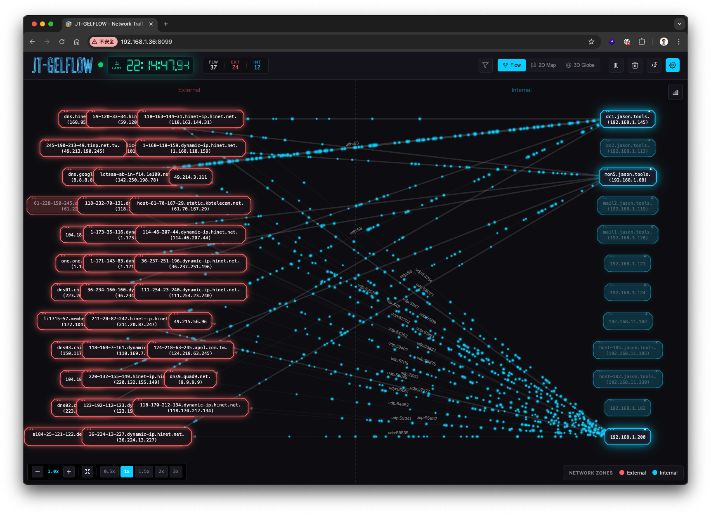
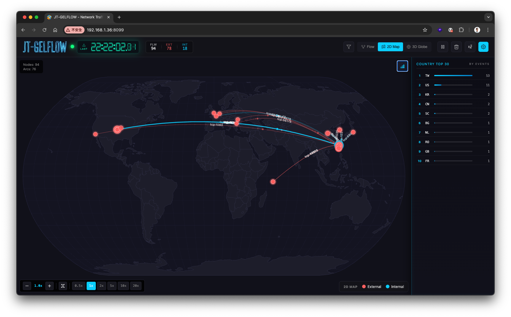
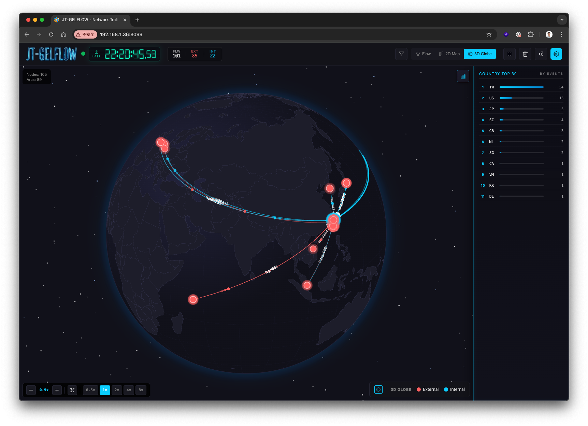
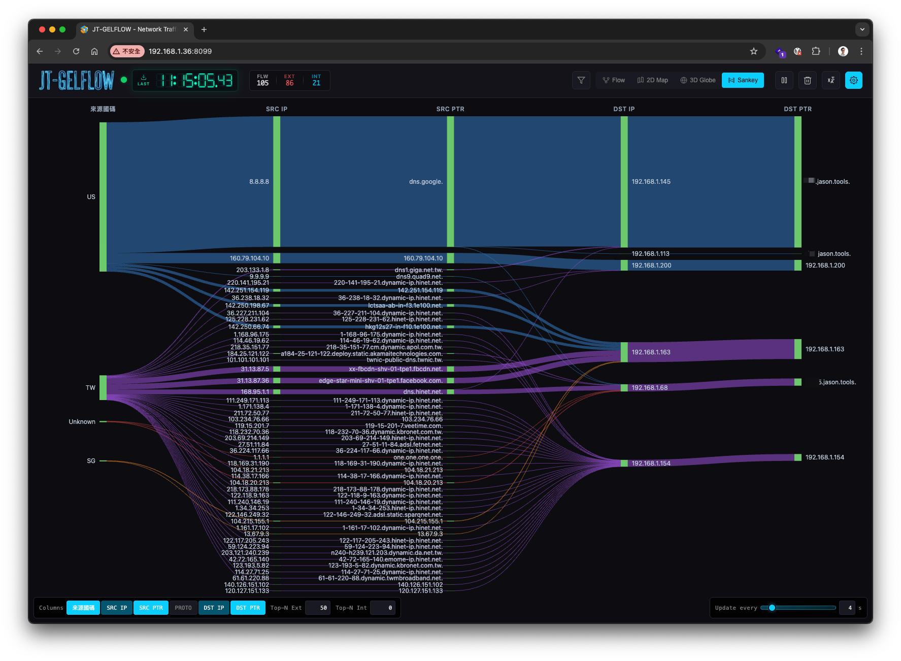
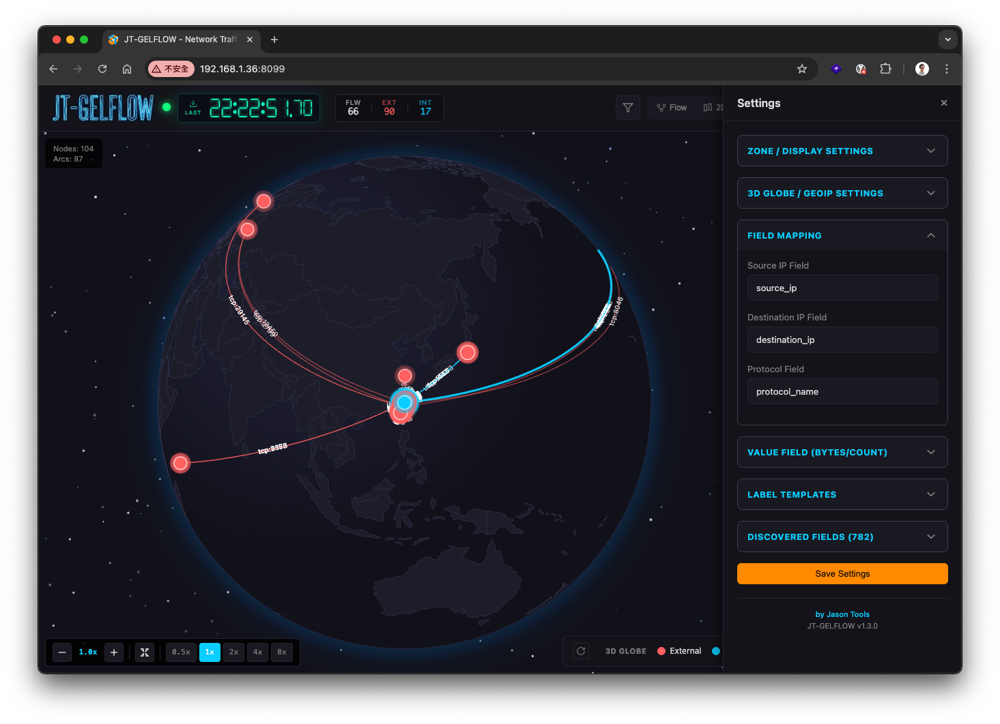

# JT-GELFLOW v1.5.4

> **Language / 語言切換：** [English](README.md) | [繁體中文](README_zh-TW.md)

[](https://www.apache.org/licenses/LICENSE-2.0)
[](https://www.python.org/)
[](https://nodejs.org/)
[](#requirements)

> **Real-time GELF network traffic visualization — Flow / 2D Map / 3D Globe / Sankey modes.**
>
> Self-hosted, single-machine, no cloud dependency. Apache 2.0.

Project site: <https://jasoncheng7115.github.io/jt-gelflow/>

---

## Three-second install

Linux only (Ubuntu / Debian / RHEL / Fedora / Arch / openSUSE):

> **Need `curl` first.** Some minimal Linux installs don't ship it. If `curl --version` says "command not found":
> Debian/Ubuntu: `sudo apt install -y curl` · RHEL/Fedora: `sudo dnf install -y curl` · Arch: `sudo pacman -S --noconfirm curl` · openSUSE: `sudo zypper install -y curl`

```bash
curl -fsSL https://raw.githubusercontent.com/jasoncheng7115/jt-gelflow/main/install.sh | sudo bash
```

When the installer finishes it prints the reachable URL — open it from a browser on another machine:
**`http://<server-ip>:8099`** (the installer auto-detects the server's primary IP and prints the exact URL).

The installer:

1. checks network connectivity to GitHub / npm / PyPI (fail-fast in 5 s),
2. installs `git`, `python3`, `pip`, `nodejs`, `npm` if missing,
3. clones into `/opt/jt-gelflow`,
4. installs Python deps + builds the frontend,
5. asks before installing & enabling the `jt-gelflow.service` systemd unit (default: yes),
6. preserves any existing `config.json` (never overwrites your data).

---

## Manage the service

```bash
sudo jt-gelflow start | stop | restart | status
sudo jt-gelflow logs                # journalctl -f
sudo jt-gelflow update              # git pull + rebuild + restart
sudo jt-gelflow uninstall           # remove binaries, keep config.json
sudo jt-gelflow uninstall --purge   # also remove config.json
```

---

## Upgrading

For routine updates from the GitHub repo:

```bash
sudo jt-gelflow update
```

If that fails (e.g. `fatal: Not possible to fast-forward` after a schema change), use the resilient path that rescues your `config.json`:

```bash
curl -fsSL https://raw.githubusercontent.com/jasoncheng7115/jt-gelflow/main/install.sh | sudo bash
```

`config.json` is `.gitignore`d and survives every upgrade. See [UPGRADE.md](UPGRADE.md) for the full SOP including pre/post checks, version pinning, and rollback.

For first-time installs, see [INSTALL.md](INSTALL.md).

---

## Demo

<video src="https://github.com/jasoncheng7115/jt-gelflow/raw/main/docs/demo.mp4" controls width="100%" poster="docs/screenshots/1_flow_en.png"></video>

If the player doesn't render, the same clip plays inline on the [project site](https://jasoncheng7115.github.io/jt-gelflow/) — or [download `demo.mp4`](docs/demo.mp4) directly.

## Screenshots

<p align="center">
  
  
</p>
<p align="center">
  
  
</p>
<p align="center">
  
</p>

---

## Features

### Four view modes

| Mode | Description |
|------|-------------|
| **Flow** | 2D animated particle flow diagram (Canvas + force-directed layout) |
| **2D Map** | Mercator world map with traffic arcs (D3 + SVG) |
| **3D Globe** | Interactive orthographic globe with auto-rotation, drag, zoom (D3 + SVG) |
| **Sankey** | Left-to-right bands from external to internal network (`d3-sankey`). Columns are toggleable: Country / Ext IP / Ext IP PTR / Protocol / Int IP / Int IP PTR (Ext IP and Int IP are mandatory). Hover any band to highlight the full chain end-to-end. |

### Core capabilities

- **GELF collector** — UDP and TCP listeners with chunked + GZIP decoding.
- **Auto field discovery** — discovers GELF fields at runtime, caches with TTL, surfaces them in the settings panel for picking.
- **Template engine** — flexible label templates: `{field}`, `{field|default}`, `{a||b||c|default}` fallback chains.
- **Zone classification** — Internal / External / Inbound / Outbound by configurable CIDRs; optional custom zones.
- **Top-N filtering** — per-view caps for internal and external nodes (Flow / 2D Map / 3D Globe / Sankey each get their own scope).
- **Real-time search** — filter nodes and connections by IP, port, protocol, or label keyword (`-` excludes, multiple terms = AND).
- **Statistics panel** — ranked by event count or traffic volume.
- **WebSocket updates** — 100 ms broadcast loop; clients fall back to long-poll on disconnect.
- **i18n** — English / 繁體中文.

### Display options

- Internal-IP whitelist filtering with per-view scope.
- Adjustable map / globe brightness.
- Starfield background for 3D Globe (toggleable).
- Auto-rotate for 3D Globe (throttled to ~20 fps so it never blocks the WebSocket).
- Breathing connection-status indicator.
- Seven-segment digital clock driven by the latest GELF message timestamp.

---

## Requirements

- Linux (systemd-based distros recommended)
- Python 3.10+
- Node.js 18+ (only required if you want to rebuild the frontend; pre-built `dist/` ships with the repo)
- Modern browser: Chrome 90+, Firefox 88+, Safari 14+, Edge 90+

---

## Configuration

Configuration lives in `/opt/jt-gelflow/config.json`. The repo ships `config.example.json`; on first install, `install.sh` seeds `config.json` from it. **`config.json` is `.gitignore`d** — `sudo jt-gelflow update` (and re-running `install.sh`) will never overwrite your settings. To reset to defaults, copy `config.example.json` over `config.json` yourself.

Key sections:

```json
{
  "gelf_udp_port": 12201,
  "gelf_tcp_port": 12202,
  "http_port": 8099,
  "flow_ttl_seconds": 5,
  "default_view": "flow",
  "mapping": {
    "src_field": "source_ip",
    "dst_field": "destination_ip",
    "proto_field": "protocol_name",
    "value_field": "network_bytes",
    "node_label_template": "{source_ip_ptr||source_ip}",
    "edge_label_template": "{protocol_name}:{destination_port|0}"
  },
  "zones": {
    "internal_cidrs": ["10.0.0.0/8", "172.16.0.0/12", "192.168.0.0/16"],
    "internal_filter_ips": [],
    "top_n_internal": 0,
    "top_n_external": 50,
    "show_internal_traffic": false
  },
  "geoip": {
    "source_field": "source_ip_geolocation",
    "destination_field": "destination_ip_geolocation",
    "internal_fallback_lat": 0,
    "internal_fallback_lng": 0,
    "auto_detect_location": true
  }
}
```

### Field mapping

The dashboard works out of the box if your GELF messages use the canonical field names (`source_ip`, `destination_ip`, `protocol_name`, `network_bytes`, `source_ip_geolocation`, `source_ip_country_code`, ...). Pipelines that emit non-canonical names — Suricata IDS, custom enrichment, vendor exports — need to map those names through the settings panel.

**Five sections of the settings panel touch field names. Changing one almost always means revisiting another.**

| Settings section | What it controls | Default fields |
|---|---|---|
| **Field Mapping** | Source / destination IP, protocol, PTR, country code | Defaults: `source_ip`, `destination_ip`, `protocol_name`, `source_ip_ptr`, `destination_ip_ptr`, `source_ip_country_code`, `destination_ip_country_code`. Common alternatives: IP — `src_ip`/`dst_ip`, `srcip`/`dstip`, `client_ip`/`server_ip`, `suricata_srcip`/`suricata_dstip`. Protocol — `proto`, `protocol`, `ip_proto`, `l4_proto`. PTR — `src_hostname`/`dst_hostname`, `srcip_ptr`/`dstip_ptr`. Country — `srcip_country_code`/`dstip_country_code`, `geoip_src_country`/`geoip_dst_country` |
| **Value Field** | Numeric field whose sum drives flow weight (bytes / packet length / event count) | `network_bytes` (Graylog), `bytes`, `length`, `datalen`, `packet_size`, `byte_count`, `octets` (NetFlow) — pick whichever name appears on the messages JT-GELFLOW actually receives (open Settings → Discovered Fields to confirm) |
| **Label Templates** | Strings rendered on each node and edge — referenced by `{field}` syntax | `{source_ip_ptr\|\|source_ip}`, `{protocol_name}:{destination_port\|0}` |
| **GeoIP** | Lat/lng field used to plot 2D Map / 3D Globe points (string `"lat,lng"`) | Default: `source_ip_geolocation`, `destination_ip_geolocation`. Common alternatives: `src_geolocation`/`dst_geolocation`, `srcip_geolocation`/`dstip_geolocation`, `geoip_src_location`/`geoip_dst_location` |
| **Zones** | Internal / external CIDRs, top-N caps, per-view filter rules | `192.168.0.0/16`, `10.0.0.0/8`, `172.16.0.0/12` |

#### What to watch when remapping

The settings panel surfaces these as separate sections, but they reference each other. If you only update Field Mapping, the canvas will silently break in subtle ways:

- **Label Templates still reference old field names.** `{source_ip}` in the template won't resolve once you rename `src_field` to `suricata_srcip` — node boxes render empty (we now fall back to the raw IP, but the template loses any PTR / fancy formatting). Fix: rewrite the templates to your new field names too.
- **GeoIP fields are independent of Field Mapping.** Renaming `src_field` does **not** rename `geoip.source_field`. The 2D Map / 3D Globe will keep looking for `source_ip_geolocation` and show no points until you update the GeoIP section.
- **Country and PTR are paired.** Country uses two GELF fields (`src_country_field` + `dst_country_field`) but a single column header. Same for PTR — change both sides if you rename either.
- **No length field?** Some sources (Suricata IDS, audit logs) don't ship a packet-byte field. Set `value_field` to a name that doesn't exist in your messages, leave `value_default` at `1`, and every event contributes 1 unit — the dashboard becomes an event-count visualisation. The Sankey hover tooltip already shows the events total.

#### Worked example: Suricata

Suricata's filebeat module emits `suricata_srcip`, `suricata_dstip`, etc. To map it through:

| Settings field | Value |
|---|---|
| `src_field` | `suricata_srcip` |
| `dst_field` | `suricata_dstip` |
| `proto_field` | `suricata_protocol` |
| `src_ptr_field` | `suricata_srcip_ptr` (or whatever your enrichment adds — leave blank if none) |
| `dst_ptr_field` | `suricata_dstip_ptr` |
| `src_country_field` | `suricata_srcip_country_code` |
| `dst_country_field` | `suricata_dstip_country_code` |
| `value_field` | `__events__` (any non-existent name → counts events) |
| `value_default` | `1` |
| `node_label_template` | `{suricata_srcip_ptr\|\|suricata_srcip}` |
| `edge_label_template` | `{suricata_protocol}:{suricata_dstport\|0}` |
| `geoip.source_field` | `suricata_srcip_geolocation` |
| `geoip.destination_field` | `suricata_dstip_geolocation` |

After saving, all four views (Flow, 2D Map, 3D Globe, Sankey) should populate. If a view stays blank, open the **Discovered Fields** section in settings to confirm the field name actually appears on incoming messages.

### Template syntax

| Syntax | Behaviour |
|--------|-----------|
| `{field}` | Field value |
| `{field\|default}` | Field, fall back to static default |
| `{a\|\|b}` | Try `a` first, fall back to `b` |
| `{a\|\|b\|default}` | Multiple field fallbacks plus a static default |

### Zone configuration

- `internal_cidrs` accepts CIDR (`192.168.1.0/24`), IP ranges (`192.168.1.10-20`), or single IPs.
- `internal_filter_ips` — when non-empty, only these IPs render on the internal side.
- `top_n_internal` / `top_n_external` — cap the visible node count by traffic (`0` = unlimited).
- `*_apply_to` — list of views the rule applies to: `flow`, `2d-geo`, `3d-globe`, `sankey`.
- `custom_zones` — optionally replace the Internal/External split with named zones, each with its own colour and pattern set.

### GeoIP

For the 2D Map / 3D Globe views, your GELF messages must carry `"lat,lng"` strings, e.g.

```json
{
  "source_ip_geolocation": "25.0330,121.5654",
  "destination_ip_geolocation": "37.7749,-122.4194"
}
```

If you only have GeoIP for one side, set `internal_fallback_lat` / `_lng` (or enable `auto_detect_location`) to give internal IPs a default position.

### Sankey width metric

Each Sankey link's width is proportional to its `link.value`, where `link.value` is the per-flow sum of the GELF field configured under **Value Field** in settings (default `network_bytes`).

| Setting | Effect on link width |
|---|---|
| `value` (default) | Width = sum of Value Field per flow. When the Value Field doesn't exist on incoming messages (e.g. Suricata IDS events have no byte length), every flow contributes `value_default` (default `1`), so width naturally degenerates to the event count. **You don't need to change anything for this case** — it's automatic. |
| `events` | Width = event count per flow, regardless of any byte data. Pick this when you have real byte data but explicitly want widths to represent event count. |

Tooltip behaviour is the same heuristic: when `link.value` happens to equal the event count (the no-byte-data case), the tooltip drops the `1.2 KB` line and shows `5 events` standalone; otherwise both show.

Set via Settings → **Sankey Settings** → Link width metric.

---

## Sending data

JT-GELFLOW accepts standard GELF over UDP (`12201`) or TCP (`12202`) — chunked and gzipped messages are fine. Common producers:

- **Graylog** GELF output
- **Logstash** `gelf` output plugin
- **Filebeat** via Logstash
- **Custom scripts** — anything that emits a JSON GELF payload terminated by a null byte (TCP) or fits in a UDP datagram

### Configuring Graylog to forward into JT-GELFLOW

The intended flow: Graylog ingests your normal logs (syslog, beats, anything), processes them, and forks a copy out to JT-GELFLOW as GELF UDP.

> **About field names.** Graylog's GELF Output forwards each message **after** the upstream chain — Input → Extractors → Pipeline Rules (if any) → GeoIP processor → stream-routing — so the field names JT-GELFLOW sees are the cumulative result of whatever your Graylog deployment does with the original log. JT-GELFLOW does not require any specific naming; just point Field Mapping at whichever names actually arrive (open **Settings → Discovered Fields** in the dashboard to see the live list).

1. **Graylog → System → Outputs → `Add new output`**
2. Type: **`GELF Output`**
3. Title: `JT-GELFLOW` (or anything you want)
4. Configuration:
   - **Transport protocol:** `UDP`
   - **Destination host:** the IP of the JT-GELFLOW box (the URL the installer printed, **without** the port)
   - **Destination port:** `12201`
   - The other fields (queue size, batch, compression) can stay at defaults; chunked + gzipped GELF is fine.
5. Save the output. Then attach it to a **stream** that contains the messages you want visualised (Streams → pick stream → `Manage Outputs` → check the new output).

That's it — within seconds the JT-GELFLOW dashboard should start showing flows. If it doesn't:

- `tcpdump -i any 'udp port 12201'` on the JT-GELFLOW box to confirm packets are arriving.
- Open Settings → "Discovered Fields" in the dashboard to confirm your GELF field names match what the visualiser expects (Source IP, Destination IP, Protocol, GeoIP). If your fields are non-canonical (Suricata, vendor exports), use the Field Mapping section to point JT-GELFLOW at them — see the [Field mapping](#field-mapping) guide above for a worked example.

> **Logstash users:** the equivalent is the `gelf` output plugin pointing at the same host on UDP `12201`. Filebeat doesn't speak GELF natively; route it through Logstash.

Send a test event:

```bash
python3 /opt/jt-gelflow/scripts/test_data_generator.py
```

Or by hand:

```python
import socket, json
sock = socket.socket(socket.AF_INET, socket.SOCK_DGRAM)
sock.sendto(json.dumps({
  "version": "1.1",
  "host": "demo",
  "short_message": "flow",
  "source_ip":      "10.0.0.10",
  "destination_ip": "8.8.8.8",
  "protocol_name":  "TCP",
  "destination_port": 443,
  "network_bytes":  1024
}).encode(), ("127.0.0.1", 12201))
# For TCP (port 12202), the JSON payload must be followed by a null byte: ... + b"\x00"
```

---

## Keyboard shortcuts

| Key | Action |
|-----|--------|
| `Space` | Pause / resume animation |
| `1` / `2` / `3` / `4` | Flow / 2D Map / 3D Globe / Sankey |
| `+` / `-` | Zoom in / out |
| `0` | Reset zoom |
| Arrow keys | Pan |

---

## REST + WebSocket API

| Method | Endpoint | Purpose |
|--------|----------|---------|
| GET    | `/api/config` | Read full configuration |
| POST   | `/api/config` | Patch configuration (partial JSON) |
| GET    | `/api/mapping` | Read field mapping |
| POST   | `/api/mapping` | Update field mapping |
| GET    | `/api/fields` | List auto-discovered fields |
| GET    | `/api/graph` | Snapshot of the current flow graph |
| GET    | `/api/stats` | Collector message + flow counts |
| POST   | `/api/template/preview` | Render a template against the latest field cache |
| POST   | `/api/template/validate` | Lint a template string |
| POST   | `/api/clear` | Clear all flows + field cache |
| GET    | `/api/detect-location` | Auto-detect server geo via `ip-api.com` |
| WS     | `/ws` | 100 ms graph broadcasts |

---

## Reverse proxy (HTTPS 443 → 8099)

`nginx` example:

```nginx
server {
  listen 443 ssl http2;
  server_name gelflow.example.com;

  ssl_certificate     /etc/ssl/certs/example.com.crt;
  ssl_certificate_key /etc/ssl/private/example.com.key;

  client_max_body_size 100M;

  location / {
    proxy_pass         http://127.0.0.1:8099;
    proxy_http_version 1.1;
    proxy_set_header   Host              $host;
    proxy_set_header   X-Real-IP         $remote_addr;
    proxy_set_header   X-Forwarded-For   $proxy_add_x_forwarded_for;
    proxy_set_header   X-Forwarded-Proto $scheme;
    proxy_set_header   Upgrade           $http_upgrade;
    proxy_set_header   Connection        "upgrade";
    proxy_read_timeout 300s;
  }
}
```

Notes:

1. `client_max_body_size 100M` — set this; large config payloads otherwise 413.
2. Mount at root path `/`, not `/jt-gelflow/`. The frontend uses absolute paths.
3. `proxy_read_timeout 300s` keeps the WebSocket alive on quiet networks.
4. The `Upgrade` / `Connection: upgrade` headers are required for the WebSocket.

---

## Development

```bash
git clone https://github.com/jasoncheng7115/jt-gelflow.git
cd jt-gelflow
pip install -r requirements.txt
npm install
npm run build           # rebuild frontend after edits
python3 run.py          # run server on :8099
```

For a faster edit loop, `npm run dev` runs Vite with HMR; the Python server still serves the API on `:8099`.

---

## Project layout

```
jt-gelflow/
├─ server/                  Python backend (aiohttp async)
│   ├─ server.py            HTTP / WebSocket / REST entry
│   ├─ gelf_collector.py    UDP + TCP listeners
│   ├─ flow_aggregator.py   Flow keying, zone classification
│   ├─ field_discovery.py   Runtime field cache
│   ├─ template.py          Label template engine
│   └─ config.py            Config dataclasses + persistence
├─ src/client/              React + TypeScript source
│   ├─ App.tsx              Main app shell, view switching
│   ├─ FlowCanvas.tsx       2D particle visualization
│   ├─ GlobeCanvas.tsx      2D Map + 3D Globe (D3)
│   ├─ SettingsPanel.tsx    Settings UI
│   ├─ SearchBar.tsx        Filter parser + UI
│   └─ utils/geoip.ts       GeoIP coord parser, formatValue
├─ dist/client/             Pre-built frontend (committed)
├─ scripts/                 Test data generator
├─ packaging/               systemd unit
├─ bin/jt-gelflow           CLI wrapper installed to /usr/local/bin
├─ docs/                    GitHub Pages landing site
├─ install.sh               one-line installer
├─ config.json              runtime configuration
└─ run.py                   entry point
```

---

## License

Apache License 2.0 — see [LICENSE](LICENSE).
Third-party dependency licenses: see [THIRD-PARTY-NOTICES.md](THIRD-PARTY-NOTICES.md).

## Author

**Jason Cheng (Jason Tools)** — GitHub [@jasoncheng7115](https://github.com/jasoncheng7115)
