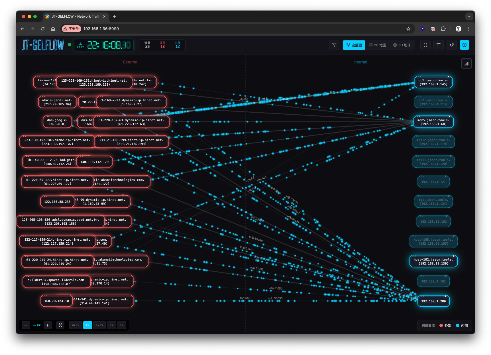
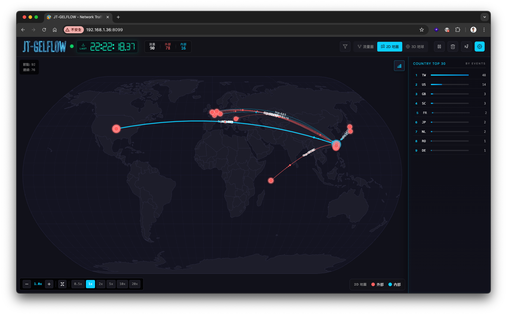
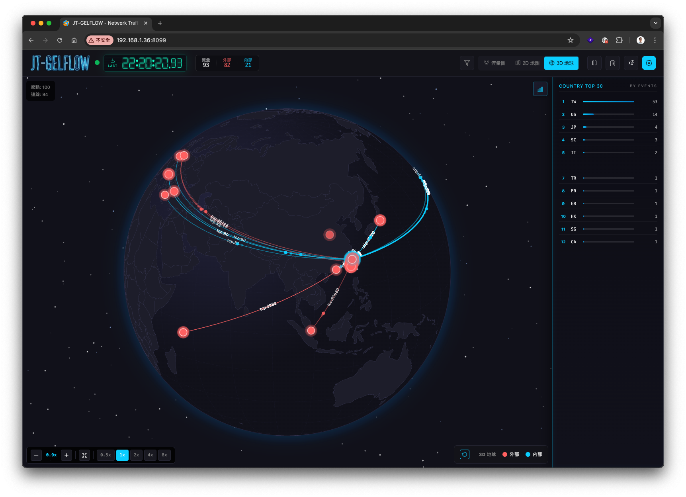
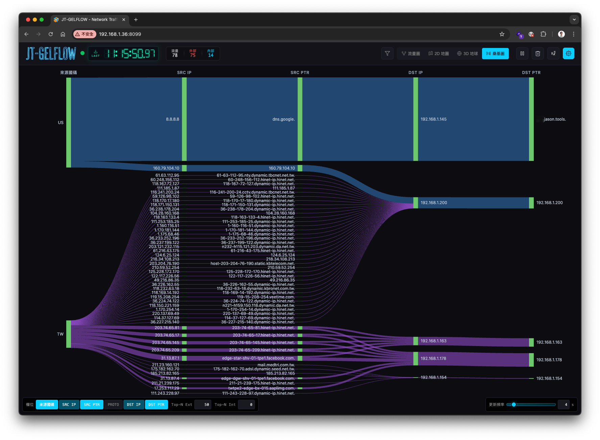
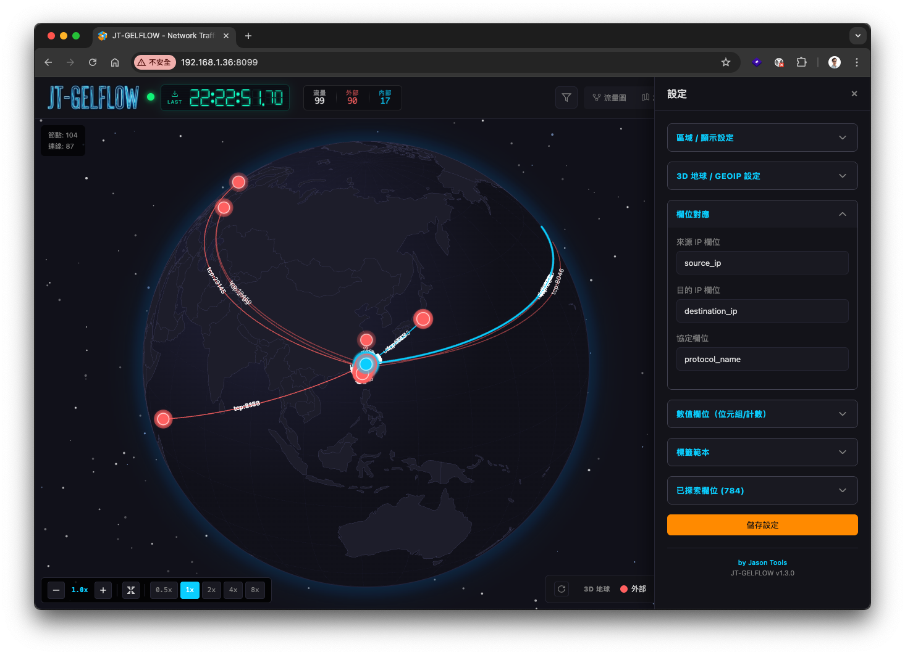

# JT-GELFLOW v1.5.1

> **Language / 語言切換：** [English](README.md) | [繁體中文](README_zh-TW.md)

[](https://www.apache.org/licenses/LICENSE-2.0)
[](https://www.python.org/)
[](https://nodejs.org/)
[](#系統需求)

> **即時 GELF 網路流量視覺化 — 流量圖 / 2D 地圖 / 3D 地球 / 桑基圖 四種檢視模式。**
>
> 自架、單機、無雲端依賴。Apache 2.0 授權。

專案介紹網站：<https://jasoncheng7115.github.io/jt-gelflow/>

---

## 三秒安裝

僅支援 Linux（Ubuntu / Debian / RHEL / Fedora / Arch / openSUSE 皆可）：

> **要先有 `curl`。** 部分極簡 Linux 安裝預設沒裝 curl。若 `curl --version` 顯示「找不到指令」：
> Debian/Ubuntu：`sudo apt install -y curl` · RHEL/Fedora：`sudo dnf install -y curl` · Arch：`sudo pacman -S --noconfirm curl` · openSUSE：`sudo zypper install -y curl`

```bash
curl -fsSL https://raw.githubusercontent.com/jasoncheng7115/jt-gelflow/main/install.sh | sudo bash
```

安裝完成後會印出實際可連線的網址，從另一台機器的瀏覽器打開：
**`http://<伺服器-IP>:8099`**（安裝程式會自動偵測伺服器主要 IP 並印出完整 URL）。

安裝程式會：

1. 檢查 GitHub / npm / PyPI 連線（5 秒內 fail-fast），
2. 自動安裝 `git`、`python3`、`pip`、`nodejs`、`npm`（已存在則跳過），
3. clone 至 `/opt/jt-gelflow`，
4. 安裝 Python 套件 + 建置前端，
5. 詢問是否啟用 systemd 服務 `jt-gelflow.service`（預設 yes），
6. 自動保留既有的 `config.json`（升級時不會覆蓋你的設定）。

---

## 服務管理

```bash
sudo jt-gelflow start | stop | restart | status
sudo jt-gelflow logs                # journalctl -f
sudo jt-gelflow update              # git pull + 重新建置 + 重啟
sudo jt-gelflow uninstall           # 移除程式但保留 config.json
sudo jt-gelflow uninstall --purge   # 連 config.json 一併刪除
```

---

## 升級

從 GitHub repo 例行更新：

```bash
sudo jt-gelflow update
```

若失敗（例如 schema 變動後出現 `fatal: Not possible to fast-forward`），改用韌性升級路徑（會救援你的 `config.json`）：

```bash
curl -fsSL https://raw.githubusercontent.com/jasoncheng7115/jt-gelflow/main/install.sh | sudo bash
```

`config.json` 已 `.gitignore`，每次升級都保留。完整 SOP（含升級前後檢查、版本鎖定、回滾）請見 [UPGRADE_zh-TW.md](UPGRADE_zh-TW.md)。

首次安裝請見 [INSTALL_zh-TW.md](INSTALL_zh-TW.md)。

---

## 操作影片

<video src="https://github.com/jasoncheng7115/jt-gelflow/raw/main/docs/demo.mp4" controls width="100%" poster="docs/screenshots/1_flow_zhtw.png"></video>

若播放器未顯示，可至[專案網站](https://jasoncheng7115.github.io/jt-gelflow/index_zh-TW.html)觀看內嵌版本，或[直接下載 `demo.mp4`](docs/demo.mp4)。

## 介面截圖

<p align="center">
  
  
</p>
<p align="center">
  
  
</p>
<p align="center">
  
</p>

---

## 功能

### 四種檢視模式

| 模式 | 說明 |
|------|------|
| **流量圖** | 2D 動態粒子流量圖（Canvas + 節點力學排版） |
| **2D 地圖** | 麥卡托投影世界地圖，含流量弧線（D3 + SVG） |
| **3D 地球** | 互動式立體地球儀，支援自動旋轉、拖曳、縮放（D3 + SVG） |
| **桑基圖** | 由左至右呈現「外網 → 內網」流量帶（`d3-sankey`）。欄位可自由開關：國別 / 外網 IP / 外網 IP 反解 / 協定 / 內網 IP / 內網 IP 反解（外網 IP、內網 IP 為必要）。游標停在任一條帶上會把整條鏈路點亮 |

### 核心能力

- **GELF 收集器** — UDP / TCP 雙協議，支援 GELF chunked 與 GZIP。
- **欄位自動探索** — 執行期間自動偵測欄位、TTL 快取，於設定面板供選用。
- **範本引擎** — 彈性標籤範本：`{field}`、`{field|default}`、`{a||b||c|default}` 多重 fallback。
- **區域分類** — 以可設定 CIDR 區分 Internal / External / Inbound / Outbound；可選自訂區域。
- **Top-N 篩選** — 內部／外部節點各檢視可獨立設定上限（流量圖 / 2D 地圖 / 3D 地球 / 桑基圖 互不影響）。
- **即時搜尋** — 可依 IP、port、protocol 或 label 關鍵字過濾（`-` 排除、多詞為 AND）。
- **統計面板** — 依事件數或流量量排序。
- **WebSocket** — 100ms 廣播；斷線時前端會自動重連。
- **多語系** — English / 繁體中文。

### 顯示選項

- 內部 IP 白名單（每個檢視可獨立套用範圍）。
- 地圖／地球亮度可調。
- 3D Globe 星空背景（可切換）。
- 3D Globe 自動旋轉（節流至約 20fps，不會卡住 WebSocket）。
- 連線狀態呼吸燈。
- 七段顯示器時鐘，由最後一則 GELF 訊息時間戳驅動。

---

## 系統需求

- Linux（建議使用 systemd 系統）
- Python 3.10+
- Node.js 18+（僅在你想重新建置前端時需要；repo 已附 `dist/` 預建檔）
- 現代瀏覽器：Chrome 90+、Firefox 88+、Safari 14+、Edge 90+

---

## 設定

設定檔位於 `/opt/jt-gelflow/config.json`。Repo 內附 `config.example.json`，首次安裝時 `install.sh` 會以此為範本產出 `config.json`。**`config.json` 已被 `.gitignore`** — `sudo jt-gelflow update`（及重跑 `install.sh`）絕不會覆蓋你的設定。要恢復預設值，自行把 `config.example.json` 蓋回 `config.json` 即可。

主要欄位：

```json
{
  "gelf_udp_port": 12201,
  "gelf_tcp_port": 12202,
  "http_port": 8099,
  "flow_ttl_seconds": 5,
  "default_view": "flow",
  "mapping": {
    "src_field": "source_ip",
    "dst_field": "destination_ip",
    "proto_field": "protocol_name",
    "value_field": "network_bytes",
    "node_label_template": "{source_ip_ptr||source_ip}",
    "edge_label_template": "{protocol_name}:{destination_port|0}"
  },
  "zones": {
    "internal_cidrs": ["10.0.0.0/8", "172.16.0.0/12", "192.168.0.0/16"],
    "internal_filter_ips": [],
    "top_n_internal": 0,
    "top_n_external": 50,
    "show_internal_traffic": false
  },
  "geoip": {
    "source_field": "source_ip_geolocation",
    "destination_field": "destination_ip_geolocation",
    "internal_fallback_lat": 0,
    "internal_fallback_lng": 0,
    "auto_detect_location": true
  }
}
```

### 欄位對應

訊息若使用標準 GELF 欄位名（`source_ip` / `destination_ip` / `protocol_name` / `network_bytes` / `source_ip_geolocation` / `source_ip_country_code` …），預設就會跑。Pipeline 改用其他命名（Suricata IDS、自家加工、廠商輸出）需要在設定面板裡把那些名稱對應過來。

**設定面板有 5 個區塊都涉及欄位名稱，動其中一個常常要連動修另一個。**

| 設定區塊 | 控制什麼 | 預設欄位 |
|---|---|---|
| **欄位對應 (Field Mapping)** | 來源/目的 IP、協定、PTR、國碼 | `source_ip`, `destination_ip`, `protocol_name`, `source_ip_ptr`, `destination_ip_ptr`, `source_ip_country_code`, `destination_ip_country_code` |
| **數值欄位 (Value Field)** | 加總後決定流量權重的數值欄位（位元組／封包長度／事件計數） | `network_bytes`（Graylog 預設）、`bytes`、`length`、`datalen`、`packet_size`、`byte_count`、`octets`（NetFlow）— 看你的 pipeline 實際送什麼 |
| **標籤範本 (Label Templates)** | 節點與連線顯示文字，用 `{field}` 引用 | `{source_ip_ptr\|\|source_ip}`, `{protocol_name}:{destination_port\|0}` |
| **GeoIP / 地理定位** | 2D 地圖／3D 地球的座標欄位 | `source_ip_geolocation`, `destination_ip_geolocation` |
| **區域設定 (Zones)** | 內外網 CIDR、Top-N 限制、各檢視套用範圍 | `192.168.0.0/16`, `10.0.0.0/8`, `172.16.0.0/12` |

#### 改欄位時的注意事項

設定面板把它們分開放，但彼此互相引用。只改了「欄位對應」其他都不動的話，畫面會悄悄壞掉、不會報錯：

- **標籤範本還在引用舊欄位名**：把 `src_field` 改成 `suricata_srcip` 之後，範本裡的 `{source_ip}` 解不出來，節點標籤就會空白（後端會 fallback 到原始 IP，但 PTR 之類的就消失了）。修法：把範本也改成新的欄位名。
- **GeoIP 欄位是獨立的**：改了 `src_field` 不會自動改 `geoip.source_field`。2D 地圖／3D 地球會繼續找 `source_ip_geolocation`，沒這個欄位就一個點也不出現，要去 GeoIP 區另外改。
- **國碼跟 PTR 是兩兩成對的**：國碼用兩個 GELF 欄位（`src_country_field` + `dst_country_field`）但只有一個欄位顯示名稱。PTR 同樣兩邊都有；改了一邊另一邊也要改。
- **沒有長度欄位？** 某些來源（Suricata IDS、稽核 log）不會送封包大小。把 `value_field` 填一個訊息中不存在的名稱，預設值維持 `1`，每個事件就貢獻 1 個單位 — 整個 dashboard 變成「事件計數」視覺化。桑基圖 hover 時的 tooltip 本來就會顯示 events 總數。

#### 範例：Suricata

Suricata 的 filebeat module 會送 `suricata_srcip`、`suricata_dstip` 等等。對應方式：

| 設定欄位 | 值 |
|---|---|
| `src_field` | `suricata_srcip` |
| `dst_field` | `suricata_dstip` |
| `proto_field` | `suricata_protocol` |
| `src_ptr_field` | `suricata_srcip_ptr`（看你的加工 pipeline 是否有產出，沒產出就留空） |
| `dst_ptr_field` | `suricata_dstip_ptr` |
| `src_country_field` | `suricata_srcip_country_code` |
| `dst_country_field` | `suricata_dstip_country_code` |
| `value_field` | `__events__`（任何不存在的名稱 → 變成事件計數） |
| `value_default` | `1` |
| `node_label_template` | `{suricata_srcip_ptr\|\|suricata_srcip}` |
| `edge_label_template` | `{suricata_protocol}:{suricata_dstport\|0}` |
| `geoip.source_field` | `suricata_srcip_geolocation` |
| `geoip.destination_field` | `suricata_dstip_geolocation` |

存檔後四種檢視（流量圖、2D 地圖、3D 地球、桑基圖）都應該有畫面。如果某個檢視還是空白，打開設定的「已探索欄位」區看看那個欄位名實際有沒有從訊息裡進來。

### 範本語法

| 語法 | 行為 |
|------|------|
| `{field}` | 直接取值 |
| `{field\|default}` | 取值，若空則用靜態預設值 |
| `{a\|\|b}` | 先試 `a`，若空則 fallback 到 `b` |
| `{a\|\|b\|default}` | 多重欄位 fallback + 靜態預設值 |

### Zone 設定

- `internal_cidrs` 接受 CIDR（`192.168.1.0/24`）、IP 範圍（`192.168.1.10-20`）或單一 IP。
- `internal_filter_ips` — 非空時，僅顯示這些內部 IP。
- `top_n_internal` / `top_n_external` — 依流量限制節點數量（`0` = 不限）。
- `*_apply_to` — 套用範圍清單：`flow`、`2d-geo`、`3d-globe`、`sankey`。
- `custom_zones` — 可選；以自訂區域（命名、顏色、pattern）取代 Internal/External 二分。

### GeoIP

2D 地圖 / 3D 地球 需 GELF 訊息攜帶 `"lat,lng"` 字串：

```json
{
  "source_ip_geolocation": "25.0330,121.5654",
  "destination_ip_geolocation": "37.7749,-122.4194"
}
```

若僅單向有 GeoIP 資料，可透過 `internal_fallback_lat` / `_lng`（或啟用 `auto_detect_location`）為內部 IP 指定預設位置。

---

## 資料來源整合

JT-GELFLOW 透過 UDP（`12201`）或 TCP（`12202`）接收標準 GELF 訊息，支援 chunked 與 gzip。常見產生器：

- **Graylog** GELF output
- **Logstash** `gelf` output plugin
- **Filebeat** 經 Logstash 轉送
- **自訂腳本** — 任何能輸出 JSON GELF 並以 null byte 結尾（TCP）或塞進 UDP datagram 的工具

### 設定 Graylog 把訊息丟到 JT-GELFLOW

預期 pipeline：Graylog 收完日常 log（syslog、beats、其他），加工完後再分一份用 GELF UDP 丟到 JT-GELFLOW 視覺化。

1. **Graylog → System → Outputs → `Add new output`**
2. Type 選 **`GELF Output`**
3. Title：`JT-GELFLOW`（或自己取）
4. 設定：
   - **Transport protocol：** `UDP`
   - **Destination host：** JT-GELFLOW 那台主機的 IP（安裝程式最後印出來的 URL 去掉 port 那段）
   - **Destination port：** `12201`
   - 其他欄位（queue size、batch、compression）保留預設即可；chunked + gzip 的 GELF 都接得起來。
5. 存檔。再把這個 output 掛到要視覺化的 **stream**（Streams → 選 stream → `Manage Outputs` → 把新加的 output 勾上）。

正常的話幾秒內就會在 JT-GELFLOW 看到流量。如果沒看到：

- 在 JT-GELFLOW 那台跑 `tcpdump -i any 'udp port 12201'`，確認封包真的有到。
- 打開設定頁的「已探索欄位」區，確認你的 GELF 欄位名稱跟視覺化端讀的對得上（Source IP、Destination IP、Protocol、GeoIP）。如果你的欄位是 Suricata 或廠商加工後的非標準命名，用「欄位對應」區把它們指過去 — 上面的[欄位對應](#欄位對應)章節有完整 Suricata 範例。

> **Logstash 使用者**：對應的設定是 `gelf` output plugin，host 填 JT-GELFLOW 主機，UDP 12201。Filebeat 本身不會直接送 GELF，要透過 Logstash 中轉。

送一筆測試訊息：

```bash
python3 /opt/jt-gelflow/scripts/test_data_generator.py
```

或手動：

```python
import socket, json
sock = socket.socket(socket.AF_INET, socket.SOCK_DGRAM)
sock.sendto(json.dumps({
  "version": "1.1",
  "host": "demo",
  "short_message": "flow",
  "source_ip":      "10.0.0.10",
  "destination_ip": "8.8.8.8",
  "protocol_name":  "TCP",
  "destination_port": 443,
  "network_bytes":  1024
}).encode(), ("127.0.0.1", 12201))
# 若改用 TCP (port 12202)，JSON payload 結尾必須補上 null byte：... + b"\x00"
```

---

## 鍵盤快捷鍵

| 鍵 | 動作 |
|----|------|
| `Space` | 暫停／繼續動畫 |
| `1` / `2` / `3` / `4` | 流量圖 / 2D 地圖 / 3D 地球 / 桑基圖 |
| `+` / `-` | 放大／縮小 |
| `0` | 重置縮放 |
| 方向鍵 | 平移 |

---

## REST + WebSocket API

| Method | Endpoint | 用途 |
|--------|----------|------|
| GET    | `/api/config` | 取得完整設定 |
| POST   | `/api/config` | 部分更新設定 |
| GET    | `/api/mapping` | 取得欄位對應 |
| POST   | `/api/mapping` | 更新欄位對應 |
| GET    | `/api/fields` | 取得自動探索的欄位 |
| GET    | `/api/graph` | 當前流量圖快照 |
| GET    | `/api/stats` | 訊息與 flow 計數 |
| POST   | `/api/template/preview` | 用最新欄位快取預覽範本 |
| POST   | `/api/template/validate` | 驗證範本語法 |
| POST   | `/api/clear` | 清空 flows 與欄位快取 |
| GET    | `/api/detect-location` | 透過 `ip-api.com` 自動偵測伺服器位置 |
| WS     | `/ws` | 100ms 流量圖即時推送 |

---

## 反向代理（HTTPS 443 → 8099）

`nginx` 範例：

```nginx
server {
  listen 443 ssl http2;
  server_name gelflow.example.com;

  ssl_certificate     /etc/ssl/certs/example.com.crt;
  ssl_certificate_key /etc/ssl/private/example.com.key;

  client_max_body_size 100M;

  location / {
    proxy_pass         http://127.0.0.1:8099;
    proxy_http_version 1.1;
    proxy_set_header   Host              $host;
    proxy_set_header   X-Real-IP         $remote_addr;
    proxy_set_header   X-Forwarded-For   $proxy_add_x_forwarded_for;
    proxy_set_header   X-Forwarded-Proto $scheme;
    proxy_set_header   Upgrade           $http_upgrade;
    proxy_set_header   Connection        "upgrade";
    proxy_read_timeout 300s;
  }
}
```

注意事項：

1. **`client_max_body_size 100M`** 必設，否則設定 payload 過大會 413。
2. **必須掛 root 路徑** `/`，不要 `/jt-gelflow/` — 前端使用絕對路徑。
3. **`proxy_read_timeout 300s`** 維持安靜時段的 WebSocket。
4. **`Upgrade` / `Connection: upgrade`** header 是 WebSocket 必要條件。

---

## 開發

```bash
git clone https://github.com/jasoncheng7115/jt-gelflow.git
cd jt-gelflow
pip install -r requirements.txt
npm install
npm run build           # 編輯後重新建置前端
python3 run.py          # 啟動伺服器於 :8099
```

開發時可用 `npm run dev` 啟用 Vite HMR；Python server 仍同時提供 `:8099` API。

---

## 專案結構

```
jt-gelflow/
├─ server/                  Python 後端（aiohttp async）
│   ├─ server.py            HTTP / WebSocket / REST 進入點
│   ├─ gelf_collector.py    UDP + TCP 收集器
│   ├─ flow_aggregator.py   Flow keying 與區域分類
│   ├─ field_discovery.py   執行期欄位快取
│   ├─ template.py          標籤範本引擎
│   └─ config.py            設定 dataclass + 持久化
├─ src/client/              React + TypeScript 原始碼
│   ├─ App.tsx              主元件、檢視切換
│   ├─ FlowCanvas.tsx       2D 粒子視覺化
│   ├─ GlobeCanvas.tsx      2D Map + 3D Globe（D3）
│   ├─ SettingsPanel.tsx    設定 UI
│   ├─ SearchBar.tsx        過濾器解析與 UI
│   └─ utils/geoip.ts       GeoIP 解析、formatValue
├─ dist/client/             已建置前端（含於 repo）
├─ scripts/                 測試資料產生器
├─ packaging/               systemd unit
├─ bin/jt-gelflow           CLI 包裝（裝完於 /usr/local/bin）
├─ docs/                    GitHub Pages 介紹網站
├─ install.sh               一行安裝指令
├─ config.json              執行期設定
└─ run.py                   進入點
```

---

## 授權

Apache License 2.0 — 詳見 [LICENSE](LICENSE)。
第三方相依授權清單：[THIRD-PARTY-NOTICES.md](THIRD-PARTY-NOTICES.md)。

## 作者

**Jason Cheng (Jason Tools)** — GitHub [@jasoncheng7115](https://github.com/jasoncheng7115)
